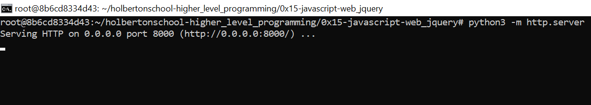

# Holbertonschool-higher_level_programming

## 0x15-javascript-web_jquery

## Lenguage
 

## Learn Objetives
- Why JQuery make front-end programming so easy (don’t forget to tweet today, with the hashtag #ilovejquery :))
- How to select HTML elements in JavaScript
- How to select HTML elements with JQuery
- What are differences between ID, class and tag name selectors
- How to modify an HTML element style
- How to get and update an HTML element content
- How to modify the DOM
- How to make a GET request with JQuery Ajax
- How to make a POST request with JQuery Ajax
- How to listen/bind to DOM events
- How to listen/bind to user events

## Resources
- [What is JavaScript?](https://intranet.hbtn.io/rltoken/FBd59d6M-Bal5PiSJbhw9g)
- [Selector](https://intranet.hbtn.io/rltoken/RtFB5Ycdvvk5OYv79zgr6A)
- [Get and set content](https://intranet.hbtn.io/rltoken/JAC2vdSj1pbH6y_9OwQrAw)
- [Manipulate CSS classes](https://intranet.hbtn.io/rltoken/Pvl_U4kdmxtHrZAHoFh_qw)
- [Manipulate DOM elements](https://intranet.hbtn.io/rltoken/fA1R3S7dNUX4lj68z6qMyw)
- [API](https://intranet.hbtn.io/rltoken/w_Y67Y3UlGQ6nluZx9KJyQ)
- [jquery introduction](https://jquery-tutorial.net/ajax/introduction/)
- [GET & POST request](https://intranet.hbtn.io/rltoken/xN81Z76ZeNgB42tyJOgXjA)
- [JQuery Ajax Tutorial #1 - Using AJAX & API’s](https://intranet.hbtn.io/rltoken/Rq2Ob5rhN-N458YBxxaRXQ)
- [What went wrong? Troubleshooting JavaScript](https://intranet.hbtn.io/rltoken/ZpjZXl5AxHmurQFuxQfB4A)
- [JQuery](https://intranet.hbtn.io/rltoken/L5nA7F44DBhrCAdlEvxrqQ)
- [JQuery API](https://api.jquery.com/)
- [JQuery Ajax](https://learn.jquery.com/ajax/)

## Requirements
- All your files will be interpreted on Chrome (version 57.0)
- Your code should be `semistandard` compliant with the flag `--global $`: `semistandard *.js --global $`
- You must use JQuery version 3.x
- You are not allowed yo user `var`

## Installation

To use, first download  this repository into your local machine by issuing the following command in your local terminal. 
```
$ git clone https://github.com/Matilop15/holbertonschool-higher_level_programming.git
```
and 
```
$ cd 0x15-javascript-web_jquery
```

## Usage
You can start a simple server using the follow python command:
```
$ python -m http.server
```
- The default port is 8000
- The default adress is http://0.0.0.0:8000/ 
- Choose the file you can view



## Files and Examples

## [0-script.js](0-script.js)

Write a JavaScript script that updates the text color of the `<header>` element to red (`#FF0000`)

File to modify [0-main.html](0-main.html):
```
root@ubuntu:~0x15-javascript-web_jquery# cat 0-main.html
<!DOCTYPE html>
<html lang="en">
  <head>
    <title>Holberton School</title>
  </head>
  <body>
    <header> 
      First HTML page
    </header>
    <footer>
      Holberton School - 2017
    </footer>
    <script type="text/javascript" src="0-script.js"></script>
  </body>
</html>
```
## [1-script.js](1-script.js)

Write a JavaScript script that updates the text color of the `<header>` element to red (`#FF0000`)

File to modify [1-main.html](1-main.html):
```
root@ubuntu:~0x15-javascript-web_jquery# cat 1-main.html
<!DOCTYPE html>
<html lang="en">
  <head>
    <title>Holberton School</title>
    <script src="https://code.jquery.com/jquery-3.2.1.min.js"></script>
  </head>
  <body>
    <header> 
      First HTML page
    </header>
    <footer>
      Holberton School - 2017
    </footer>
    <script type="text/javascript" src="1-script.js"></script>
  </body>
</html>
```
## [2-script](2-script)

Write a JavaScript script that updates the text color of the `<header>` element to red (`#FF0000`) when the user clicks on the tag `DIV#red_header`

File to modify [2-main.html](2-main.html):
```
root@ubuntu:~0x15-javascript-web_jquery# cat 2-main.html
<!DOCTYPE html>
<html lang="en">
  <head>
    <title>Holberton School</title>
    <script src="https://code.jquery.com/jquery-3.2.1.min.js"></script>
  </head>
  <body>
    <header> 
      First HTML page
    </header>
    <footer>
      Holberton School - 2017
    </footer>
    <script type="text/javascript" src="1-script.js"></script>
  </body>
</html>
```
## [3-script](3-script)

Write a JavaScript script that adds the `class red` to the `<header>` element when the user clicks on the tag `DIV#red_header`

File to modify [3-main.html](3-main.html):
```
root@ubuntu:~0x15-javascript-web_jquery# cat 3-main.html
<!DOCTYPE html>
<html lang="en">
  <head>
    <title>Holberton School</title>
    <script src="https://code.jquery.com/jquery-3.2.1.min.js"></script>
    <style>
      .red {
        color: #FF0000;
      }
    </style>
  </head>
  <body>
    <header> 
      First HTML page
    </header>
    <div id="red_header">Red header</div>
    <footer>
      Holberton School - 2017
    </footer>
    <script type="text/javascript" src="3-script.js"></script>
  </body>
</html>
```
## [4-script](4-script)

Write a JavaScript script that toggles the class of the `<header>` element when the user clicks on the tag `DIV#toggle_header`:
    - The `<header>` element must always have one class: red or green, never both in the same time and never empty.
    - If the current class is red, when the user click on `DIV#toggle_header`, the class must be updated to green ; and the reverse.

File to modify [4-main.html](4-main.html):
```
root@ubuntu:~0x15-javascript-web_jquery# cat 4-main.html
<!DOCTYPE html>
<html lang="en">
  <head>
    <title>Holberton School</title>
    <script src="https://code.jquery.com/jquery-3.2.1.min.js"></script>
    <style>
      .red {
        color: #FF0000;
      }
      .green {
        color: #00FF00;
      }
    </style>
  </head>
  <body>
    <header class="green"> 
      First HTML page
    </header>
    <div id="toggle_header">Toggle header</div>
    <footer>
      Holberton School - 2017
    </footer>
    <script type="text/javascript" src="4-script.js"></script>
  </body>
</html>
```
## [5-script](5-script)

Write a JavaScript script that adds a `<li>` element to a list when the user clicks on the tag `DIV#add_item`:
    - The new element must be: `<li>Item</li>`
    - The new element must be added to `UL.my_list`

File to modify [5-main.html](5-main.html):
```
root@ubuntu:~0x15-javascript-web_jquery# cat 5-main.html
<!DOCTYPE html>
<html lang="en">
  <head>
    <title>Holberton School</title>
    <script src="https://code.jquery.com/jquery-3.2.1.min.js"></script>
  </head>
  <body>
    <header> 
      First HTML page
    </header>
    <br />
    <div id="add_item">Add item</div>
    <br />
    <ul class="my_list">
      <li>Item</li>
    </ul>
    <footer>
      Holberton School - 2017
    </footer>
    <script type="text/javascript" src="5-script.js"></script>
  </body>
</html>
```
## [6-script](6-script)

Write a JavaScript script that updates the text of the `<header>` element to `New Header!!!` when the user clicks on `DIV#update_header`

File to modify [6-main.html](6-main.html):
```
root@ubuntu:~0x15-javascript-web_jquery# cat 6-main.html
<!DOCTYPE html>
<html lang="en">
  <head>
    <title>Holberton School</title>
    <script src="https://code.jquery.com/jquery-3.2.1.min.js"></script>
  </head>
  <body>
    <header> 
      First HTML page
    </header>
    <br />
    <div id="update_header">Update the header</div>
    <br />
    <footer>
      Holberton School - 2017
    </footer>
    <script type="text/javascript" src="6-script.js"></script>
  </body>
</html>
```
## [7-script](7-script)

Write a JavaScript script that fetches the character `name` from this URL: https://swapi-api.hbtn.io/api/people/5/?format=json
    - The name must be displayed in the HTML tag `DIV#character`

File to modify [7-main.html](7-main.html):
```
root@ubuntu:~0x15-javascript-web_jquery# cat 7-main.html
<!DOCTYPE html>
<html lang="en">
  <head>
    <title>Holberton School</title>
    <script src="https://code.jquery.com/jquery-3.2.1.min.js"></script>
  </head>
  <body>
    <header> 
      Star Wars character
    </header>
    <br />
    <div id="character"></div>
    <br />
    <footer>
      Holberton School - 2017
    </footer>
    <script type="text/javascript" src="7-script.js"></script>
  </body>
</html>
```
## [8-script](8-script)

Write a JavaScript script that fetches and lists the `title` for all movies by using this URL: https://swapi-api.hbtn.io/api/films/?format=json
    - All movie titles must be list in the HTML tag `UL#list_movies`

File to modify [8-main.html](8-main.html):
```
root@ubuntu:~0x15-javascript-web_jquery# cat 8-main.html
<!DOCTYPE html>
<html lang="en">
  <head>
    <title>Holberton School</title>
    <script src="https://code.jquery.com/jquery-3.2.1.min.js"></script>
  </head>
  <body>
    <header> 
      Star Wars movies
    </header>
    <br />
    <ul id="list_movies">
    </ul>
    <br />
    <footer>
      Holberton School - 2017
    </footer>
    <script type="text/javascript" src="8-script.js"></script>
  </body>
</html>
```
## [9-script](9-script)

Write a JavaScript script that fetches from https://fourtonfish.com/hellosalut/?lang=fr and displays the value of `hello` from that fetch in the HTML tag `DIV#hello`:
    - The translation of “hello” must be displayed in the HTML tag `DIV#hello`

File to modify [9-main.html](9-main.html):
```
root@ubuntu:~0x15-javascript-web_jquery# cat 9-main.html
<!DOCTYPE html>
<html lang="en">
  <head>
    <title>Holberton School</title>
    <script src="https://code.jquery.com/jquery-3.2.1.min.js"></script>
    <script type="text/javascript" src="9-script.js"></script>
  </head>
  <body>
    <header> 
      Say Hello!
    </header>
    <br />
    <div id="hello"></div>
    <br />
    <footer>
      Holberton School - 2017
    </footer>
  </body>
</html>
```
## Author
[Matias López](https://uy.linkedin.com/in/matias-l%C3%B3pez-777796194?trk=people-guest_people_search-card)
